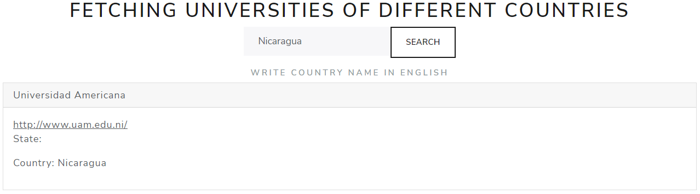

<div align="center" id="top"> 
  

  &#xa0;

  <!-- <a href="https://realtimebustracker.netlify.app">Splash</a> -->
</div>

<h1 align="center">WORLD-UNIV - Project</h1>

<p align="center">
  

  

  

  

  <!--  -->

  <!--  -->

  <!--  -->
</p>

<!-- Status -->

<!-- <h4 align="center"> 
	🚧  Real Time Bus Tracker 🚀 Under construction...  🚧
</h4> 

<hr> -->

<p align="center">
  <a href="#dart-about">About</a> &#xa0; | &#xa0; 
  <a href="#sparkles-features">Features</a> &#xa0; | &#xa0;
  <a href="#rocket-technologies">Technologies</a> &#xa0; | &#xa0;
  <a href="#white_check_mark-requirements">Requirements</a> &#xa0; | &#xa0;
  <a href="#checkered_flag-starting">Starting</a> &#xa0; | &#xa0;
  <a href="#memo-license">License</a> &#xa0; | &#xa0;
  <a href="#recycle-improvements">Improvements</a> &#xa0; | &#xa0;	
  <a href="https://github.com/bayardorivas" target="_blank">Author</a>
</p>

<br>

## :dart: About ##

WORLD-UNIV is a project that list universities of the country that is queried. In this case 
I use this [API](http://universities.hipolabs.com/search?country=).

This project was created with React [React](https://en.reactjs.org/), and using three hooks: useState, useEffect, useReducer.

## :sparkles: Features ##

:heavy_check_mark: Query by country

## :rocket: Technologies ##

The following tools were used in this project:

- React JSX (useState, useEffect, useReducer)
- HTML
- CSS
- [Babel](https://babeljs.io/)
- [Bootswatch](https://bootswatch.com/)

## :white_check_mark: Requirements ##

Before starting : you need to have [Git](https://git-scm.com) and [Node](https://nodejs.org/en/) installed to clone de the project, and run a local web server (you can user Live Server of Visual Studio Code).

## :checkered_flag: Starting ##

```bash
# Clone this project
$ git clone https://github.com/bayardorivas/WORLD-UNIV

# Access
$ cd WORLD-UNIV

# Just Open the index.html file on your browser
```
## :recycle: Improvements ##

It would be nice the next improvements:
- [ ] Select the number of universities listed by page.
- [ ] Add a checkbox and create a new array for universities of interes.

## :memo: License ##

This project is under license from MIT. For more details, see the [LICENSE](LICENSE.md) file.

Made with :heart: by <a href="https://github.com/bayardorivas" target="_blank">Bayardo Rivas</a>

&#xa0;

<a href="#top">Back to top</a>
